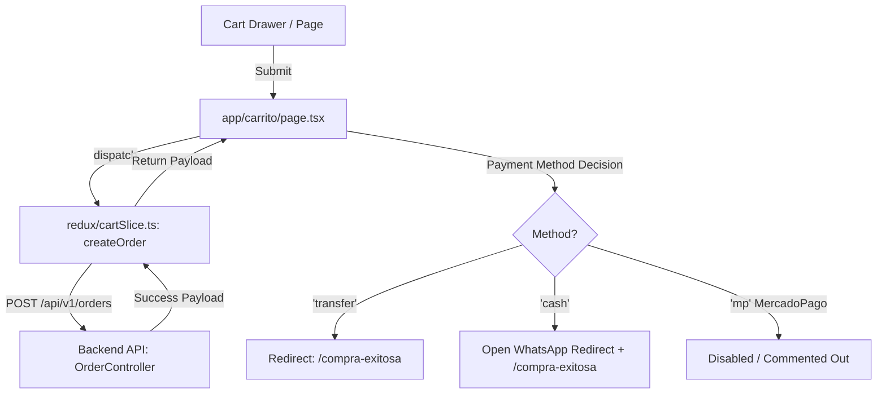

# AGENTS.md - Frontend Documentation

This file provides guidance to AI coding assistants and developers when working with code in this frontend repository.

## Project Overview

This is a Next.js 16 e-commerce application for **"Puros Mates"** - an online store selling Argentine artisanal mates. The frontend is built with Next.js App Router, TypeScript, and Tailwind CSS. It communicates with a Spring Boot backend API typically running on `http://localhost:8080`.

## Development Commands

```bash
# Start development server (runs on http://localhost:3000)
npm run dev

# Build for production
npm run build

# Start production server (must build first)
npm start

# Run linter
npm run lint
```

### Backend Connection

The application expects a backend API running on `http://localhost:8080`. The Next.js server proxies API requests from `/api/v1/*` to the backend via rewrites configured in [next.config.ts](file:///Users/tomasgonzalezh/Projects/purosmates/front-purosmates/next.config.ts).

---

## 🏗️ Architecture Overview

### Key Directories

- [app/](file:///Users/tomasgonzalezh/Projects/purosmates/front-purosmates/app/): Application routes, layouts, and page-specific logic (Next.js App Router).
- [components/](file:///Users/tomasgonzalezh/Projects/purosmates/front-purosmates/components/): Reusable UI React components (Navbar, CartDrawer, etc.).
- [redux/](file:///Users/tomasgonzalezh/Projects/purosmates/front-purosmates/redux/): Centralized state management using Redux Toolkit.
- [lib/](file:///Users/tomasgonzalezh/Projects/purosmates/front-purosmates/lib/): API clients, helper functions, and revalidation actions.

### State Management (Redux Toolkit)

- **Store Configuration**: [redux/store.ts](file:///Users/tomasgonzalezh/Projects/purosmates/front-purosmates/redux/store.ts) wraps the application and syncs the shopping cart to `localStorage` automatically via a client-side subscription.
- **Slices**:
  - [authSlice.ts](file:///Users/tomasgonzalezh/Projects/purosmates/front-purosmates/redux/authSlice.ts): Stores authenticated user email/roles synced from Clerk (does NOT store JWTs).
  - [cartSlice.ts](file:///Users/tomasgonzalezh/Projects/purosmates/front-purosmates/redux/cartSlice.ts): Manages cart actions, checkout request, and item/variant structures.
  - [adminSlice.ts](file:///Users/tomasgonzalezh/Projects/purosmates/front-purosmates/redux/adminSlice.ts): Handles product updates, orders retrieval, and admin actions.
  - [productSlice.ts](file:///Users/tomasgonzalezh/Projects/purosmates/front-purosmates/redux/productSlice.ts) & [categorySlice.ts](file:///Users/tomasgonzalezh/Projects/purosmates/front-purosmates/redux/categorySlice.ts): Fetching storefront catalogues.

### Authentication & API Security (Clerk)

- **Integration**: Clerk (`@clerk/nextjs`) manages identity. The backend validates Clerk session JWTs as an OAuth2 resource server.
- **Hook Context**: [context/AuthContext.tsx](file:///Users/tomasgonzalezh/Projects/purosmates/front-purosmates/context/AuthContext.tsx) exposes the `useAuth()` hook.
- **Token Lifetime Warning**: Clerk JWT tokens expire after **60 seconds**.
  > [!IMPORTANT]
  > **NEVER** cache the result of `getToken()` in state, Redux, or localStorage. Always call `getToken()` immediately before each request.
- **API Wrapper**: [lib/apiClient.ts](file:///Users/tomasgonzalezh/Projects/purosmates/front-purosmates/lib/apiClient.ts) exposes `requireFreshToken` and `withAuthRetry` to automatically renew tokens on failure or handle unauthenticated users.

---

## 🛒 Navigating the Checkout Flow

If the checkout, cart, or payment fails, use the following guide to locate and debug the problem:



### 1. The Checkout Page: [app/carrito/page.tsx](file:///Users/tomasgonzalezh/Projects/purosmates/front-purosmates/app/carrito/page.tsx)

- Validates user input (whether user is authenticated via Clerk or filling out guest data).
- Validates mandatory fields based on shipping preferences (locality, exact address, floor/apartment).
- Calls `dispatch(createOrder(...))` to contact the backend.

### 2. State & Thunks: [redux/cartSlice.ts](file:///Users/tomasgonzalezh/Projects/purosmates/front-purosmates/redux/cartSlice.ts)

- `createOrder` thunk structures the payload.
- Merges selected variants (`variantId`, `quantity`, `hasCustomization`) into `items`.
- Sends authentication token if `isAuthenticated` is true, otherwise registers guest data.
- Hits `POST /api/v1/orders`.

### 3. Payment Methods & Redirection:

- **Bank Transfer (`'transfer'`)**: Shows success toast, then redirects directly to `/compra-exitosa?orderId={id}`.
- **Cash / WhatsApp (`'cash'`)**: Opens a WhatsApp message template (`https://wa.me/5491130548207?text=...`) to confirm with the store owner, then redirects to `/compra-exitosa?orderId={id}`.
- **Mercado Pago (`'mp'`)**: Currently **disabled** (`// [DESHABILITADO] MercadoPago — no se usa hasta reactivar MP`).

---

## 🖼️ Image Handling & CDN

Product images support transformations (scale, x, y positioning) stored in the database:

```typescript
{
  url: string;
  scale?: number;
  x?: number;
  y?: number;
}
```

Remote image patterns are whitelisted in [next.config.ts](file:///Users/tomasgonzalezh/Projects/purosmates/front-purosmates/next.config.ts) (`localhost:8080` and `**.cloudinary.com`). The custom loader [lib/cloudinary.ts](file:///Users/tomasgonzalezh/Projects/purosmates/front-purosmates/lib/cloudinary.ts) handles Direct CDN transformation query parameters.

## 🚀 Cache & Revalidation

- **Incremental Static Regeneration (ISR)**: The homepage and shop use ISR (`revalidate = 60`) to avoid hammering the backend database.
- **On-Demand Revalidation**: Admin actions trigger immediate cache invalidation via [lib/actions/revalidate.actions.ts](file:///Users/tomasgonzalezh/Projects/purosmates/front-purosmates/lib/actions/revalidate.actions.ts) (`revalidateStorefront(paths)`) to ensure admin modifications appear instantly.
